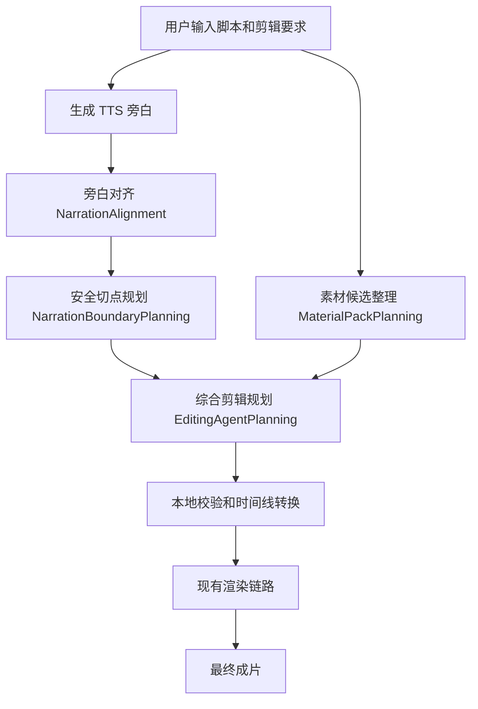

# EditingAgentPlanning 综合剪辑 PRD

- 日期：2026-07-01
- 状态：方案草案
- 来源：GitHub Issue [#136](https://github.com/nanzhi84/lead-gen-video-workflow/issues/136)
- 相关依赖：GitHub Issue [#135](https://github.com/nanzhi84/lead-gen-video-workflow/issues/135)

## 1. 一句话概括

新增一个「AI 综合剪辑规划」能力：系统在生成短视频时，不再只靠固定规则分别挑人像、B-roll、字体和 BGM，而是让 LLM 像剪辑师一样，根据脚本、素材标注、旁白时间线和用户额外要求，统一决定整条视频用哪些素材、放在哪些语义段、采用什么字幕字体和 BGM。

第一版只做 MVP：LLM 负责语义选择，本地系统负责精确时间线和渲染校验，保证下游视频生成稳定。

## 2. 背景

当前数字人短视频生成链路已经可以稳定产出视频，但剪辑规划主要由多个确定性节点分别完成：

- 人像主轨由规则选择。
- B-roll 由规则插入。
- 字幕字体和 BGM 由样式规划节点选择。
- 最后再组合成最终时间线。

这个方式稳定，但有一个明显问题：每个环节单独决策，系统很难像真人剪辑师一样理解「整条视频」。

例如，用户希望「这条视频里尽量使用穿搭相似的人像素材」，当前规则链路很难把这个要求同时作用到人像主轨、B-roll 节奏、字幕风格和 BGM 气质上。

## 3. 要解决的问题

### 3.1 现有问题

1. 剪辑语义理解分散  
   A-roll、B-roll、字体、BGM 分别规划，缺少统一判断。

2. 单条视频的个性化要求难以表达  
   例如「人像尽量是同类穿搭」「多展示施工过程」「少用 B-roll，突出主讲信任感」。

3. B-roll 只是补充插入，不是真正综合剪辑  
   当前更像是在主轨已经确定后再插画面，而不是从一开始整体规划整条视频。

4. 素材标注没有被充分综合利用  
   BGM 已有情绪、能量、段落等标注；B-roll 和 portrait 也有候选信息，但目前没有统一交给一个「总导演」做全局取舍。

### 3.2 期望效果

让系统具备一个「AI 剪辑导演」能力：

- 看懂脚本表达重点。
- 看懂旁白每句话对应的时间段。
- 看懂素材候选的语义标签和使用建议。
- 能根据额外 prompt 做个性化选择。
- 统一输出人像、B-roll、字体、BGM 的规划。
- 下游仍然用现有稳定渲染链路生成视频。

## 4. 目标

### 4.1 产品目标

第一版目标是提升短视频剪辑规划的语义一致性，让每条视频可以根据脚本内容和用户要求做差异化剪辑。

### 4.2 用户价值

对运营/投放：

- 可以用自然语言提出本条视频的剪辑要求。

对素材运营：

- 已标注的素材信息能被更充分利用。

对工程/生产系统：

- 下游渲染链路保持稳定。
- 旧确定性模板不被替换，便于灰度。
- LLM 输出先经过本地校验，避免直接破坏时间线。

## 5. MVP 范围

### 5.1 本期要做

新增一个工作流模板：

```text
digital_human_editing_agent_v1
```

新增一个核心节点：

```text
EditingAgentPlanning
```

它负责一次性规划：

- A-roll：人像主轨素材选择。
- B-roll：哪些语义段需要覆盖画面，以及用哪个素材。
- 字体：从当前字体候选中选择。
- BGM：从当前 BGM 候选中选择。
- 理由：记录为什么这样选，方便排查和优化。

### 5.2 本期不做

- 不替换旧 `digital_human_v2` 模板。
- 不做多子代理协作。
- 不做无限循环式 agent。
- 不让 LLM 直接输出精确帧号。
- 不做节奏档位配置。
- 不改最终渲染链路。
- 不增强字体标注，字体先保持现状。
- 不让 LLM 自己判断音频气口。

## 6. 前置依赖

本能力建议依赖 #135 先完成：新增 `NarrationBoundaryPlanning`，把「安全切点」和「时间线窗口」提前规划好。

原因是：LLM 不适合自己判断精确到帧的剪辑点。系统应该先把旁白、气口、安全切点整理成一组可选窗口，再让 LLM 在这些窗口里做素材选择。

也就是说：

```text
系统先决定哪里可以安全切
LLM 再决定每个安全窗口里用什么素材
系统最后把选择转换成精确时间线并渲染
```

## 7. 核心用户流程

### 7.1 用户使用流程

1. 用户进入视频生成页面。
2. 用户输入脚本、选择案例和基础设置。
3. 用户可选填写「剪辑要求」。
4. 系统生成旁白音频。
5. 系统识别旁白时间线和安全切点。
6. 系统整理可用人像、B-roll、字体、BGM 候选。
7. LLM 根据脚本、素材和剪辑要求输出综合剪辑方案。
8. 系统校验方案并转换为正式时间线。
9. 下游渲染生成最终视频。

### 7.2 剪辑要求示例

用户可以输入：

```text
尽量每个素材用同样类似衣服穿搭的人像。
```

也可以输入：

```text
这条视频重点突出施工过程，B-roll 可以多一点。
```

或：

```text
这条用于信任建立，少用花哨切镜，主讲画面保持稳定。
```

## 8. 产品形态

### 8.1 新增输入项

在视频生成配置里新增一个可选字段：

```text
剪辑要求
```

字段说明：

- 类型：长文本。
- 默认：空。
- 作用：只影响当前这条视频的剪辑规划。
- 示例 placeholder：`例如：尽量使用穿搭相近的人像素材，B-roll 多展示施工细节。`

## 9. 系统流程

### 9.1 MVP 工作流

```text
ValidateRequest
LoadCaseContext
ResolveCreativeIntent
TTS
NarrationAlignment
NarrationBoundaryPlanning
MaterialPackPlanning
EditingAgentPlanning
TimelinePlanning
PortraitTrackBuild
LipSync
RenderFinalTimeline
SubtitleAndBgmMix
ExportFinishedVideo
FinalizeRunReport
```

### 9.2 流程图



## 10. LLM 在 MVP 里做什么

LLM 只负责「像剪辑师一样做选择」，不负责精确剪辑执行。

LLM 会看到：

- 脚本和标题。
- 用户额外剪辑要求。
- 旁白每句话的文本和时间段。
- 系统已经规划好的安全切点和剪辑窗口。
- 可选人像素材。
- 可选 B-roll 素材。
- 可选字体。
- 可选 BGM。

LLM 输出：

- 每个人像窗口用哪个人像素材。
- 哪些语义段插入 B-roll，以及用哪个 B-roll。
- 字体选择。
- BGM 选择。
- 每个选择的理由。

LLM 不输出：

- 精确帧号。
- 自己发明的素材 ID。
- 自己发明的时间点。
- 最终渲染命令。

## 11. 本地系统负责什么

本地系统负责所有硬约束：

- 检查 LLM 选择的素材是否真实存在。
- 检查每个窗口是否都被覆盖。
- 检查素材时长是否够用。
- 检查 B-roll 是否重叠。
- 检查 B-roll 是否超出安全窗口。
- 把 LLM 的选择转换成精确帧号。
- 输出下游渲染可消费的正式 artifact。

这能避免 LLM 随机输出错误时间线。

## 12. 输出结果

`EditingAgentPlanning` 最终输出三个现有下游可以消费的规划结果：

```text
plan.portrait
plan.broll
plan.style
```

含义：

- `plan.portrait`：人像主轨怎么铺。
- `plan.broll`：B-roll 怎么覆盖。
- `plan.style`：字幕字体、BGM、字幕样式怎么用。

下游节点不需要理解 LLM，只需要继续按现有方式渲染。

## 13. 示例

### 13.1 用户输入

```text
剪辑要求：尽量每个素材用同样类似衣服穿搭的人像，B-roll 只在讲施工细节时出现。
```

### 13.2 系统给 LLM 的信息摘要

```text
脚本：今天带你看一下这套案例。第一步先看施工前...

可用人像：
- 人像 A：白色上衣，年轻女性，口播稳定
- 人像 B：黑色上衣，年轻女性，表情自然

可用 B-roll：
- 施工前细节
- 施工过程
- 完工效果

安全剪辑窗口：
- 窗口 1：开场介绍
- 窗口 2：施工前
- 窗口 3：施工过程
```

### 13.3 LLM 输出的语义选择

```text
窗口 1：使用人像 A，因为符合穿搭一致要求。
窗口 2：继续使用人像 A，保持主讲连续感。
窗口 3：插入施工过程 B-roll，因为这句话讲到施工细节。
字体：使用默认清晰字幕字体。
BGM：使用稳定、不抢人声的背景音乐。
```

### 13.4 系统执行

系统把这些选择转换成精确时间线，然后继续走现有渲染链路生成成片。

## 14. 成功指标

### 14.1 产品效果指标

- 人工审片时，「素材语义不贴合」问题减少。
- 同一条视频内，人像风格一致性提升。
- B-roll 出现位置更贴合脚本文义。
- BGM 和视频语气更匹配。
- 用户额外剪辑要求能在成片中被体现。

### 14.2 工程稳定性指标

- 新模板可以完整跑通并产出最终视频。
- 下游渲染不需要为 LLM 做特殊兼容。
- LLM 输出非法 ID 时能被拦截。
- LLM 输出不完整时能 repair 或 fail-fast。
- 旧模板 `digital_human_v2` 不受影响。

## 15. 验收标准

### 15.1 功能验收

- 用户可以为单条视频填写剪辑要求。
- 新模板可以调用 `EditingAgentPlanning`。
- LLM 能综合选择人像、B-roll、字体和 BGM。
- LLM 选择结果能被系统转换成正式时间线。
- 成片能正常生成。

### 15.2 质量验收

- LLM 不允许使用候选列表之外的素材。
- LLM 不允许发明不存在的时间段。
- 人像主轨必须覆盖完整旁白。
- B-roll 不得重叠，不得超出安全窗口。
- 字体候选为空时走默认字体。
- BGM 候选为空或关闭时不强行添加 BGM。

### 15.3 回归验收

- 旧 `digital_human_v2` 模板仍然可用。
- 原有 deterministic 规划链路不被替换。
- `TimelinePlanning` 仍保持校验职责，不重新推导时间线。

## 16. 风险与应对

| 风险 | 说明 | 应对 |
| --- | --- | --- |
| LLM 选错素材 | 可能选择不存在或不合适的素材 | 所有 ID 必须本地校验，非法选择不落地 |
| LLM 破坏时间线 | 可能输出错误时间点或时长 | MVP 禁止 LLM 输出权威时间点，只能选窗口 ID |
| 成本和耗时增加 | 多一次 LLM 调用 | 新模板灰度启用，保留旧模板 |
| 输出不稳定 | LLM 结果可能有波动 | 固定输入结构、限制输出 JSON、最多一次 repair |
| 字体选择效果有限 | 当前字体标注较薄 | MVP 先默认选择，后续再增强字体语义标注 |
| 用户要求过于主观 | 例如「更高级一点」不够明确 | 先支持可执行要求，后续沉淀提示词模板 |

## 17. 灰度策略

第一阶段只新增模板，不替换旧模板：

```text
digital_human_v2                 旧稳定链路
digital_human_editing_agent_v1   新 LLM 综合剪辑链路
```

灰度方式：

- 内部案例先使用新模板。
- 对比同脚本下旧模板和新模板成片。
- 人工评估语义贴合度、素材一致性、BGM 匹配度。
- 通过后再开放给更多任务。

## 18. 里程碑

### M0：前置能力完成

- 完成 #135。
- 系统能提前生成安全切点和剪辑窗口。

### M1：EditingAgentPlanning MVP

- 新增 `EditingAgentPlanning` 节点。
- 新增 `digital_human_editing_agent_v1` 模板。
- LLM 可以输出综合剪辑选择。
- 本地 materializer 可以生成 `plan.portrait`、`plan.broll`、`plan.style`。

### M2：前端入口

- 视频生成页支持填写「剪辑要求」。
- 支持选择或启用新模板。

### M3：灰度评估

- 选取真实案例跑对比。
- 记录人工审片反馈。
- 根据反馈调整 prompt、候选摘要和校验规则。

## 19. 后续方向

MVP 稳定后，可以继续升级：

- 把素材候选查询、校验、评分封装成受控 tools。
- 让 agent 在有限次数内自我修正。
- 增强字体标注，让字体也具备风格语义。
- 输出更详细的剪辑解释，供运营复盘。
- 和 DAG 调度优化结合，减少整体耗时。

